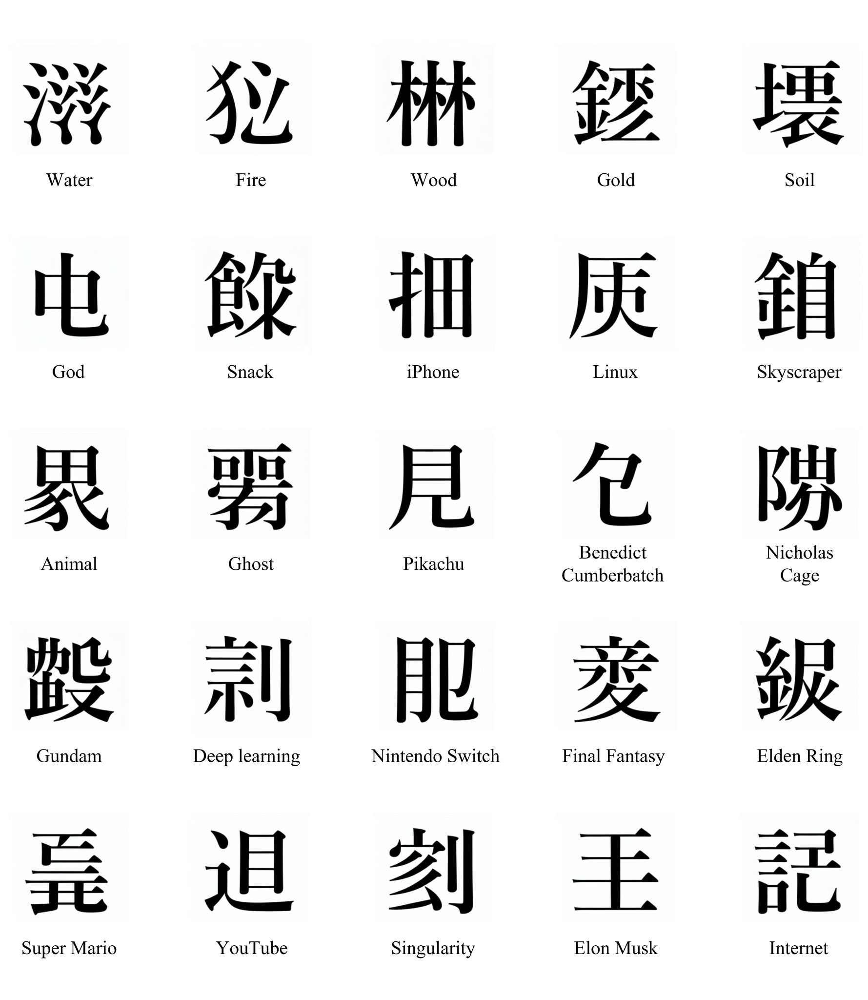
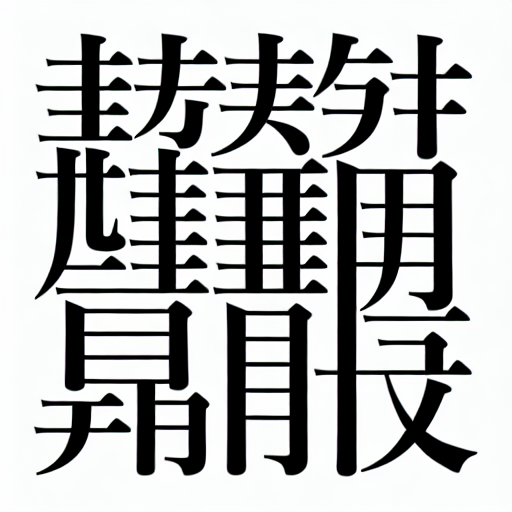
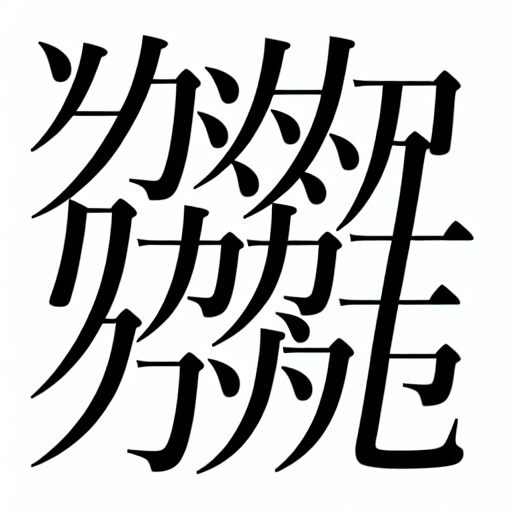
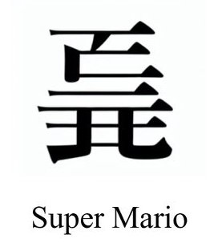
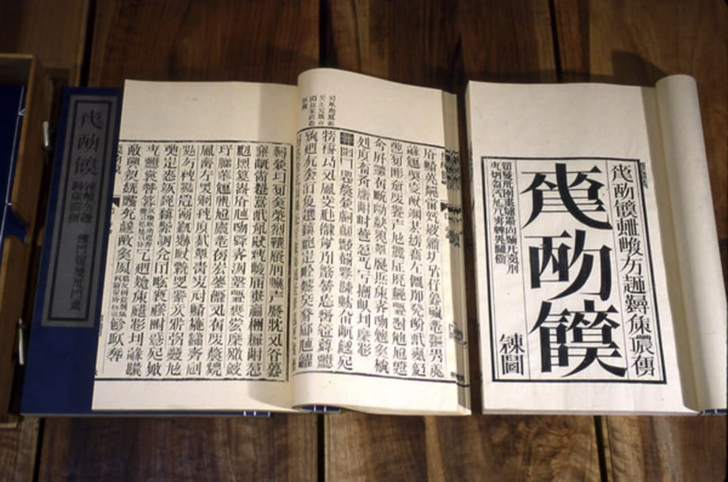
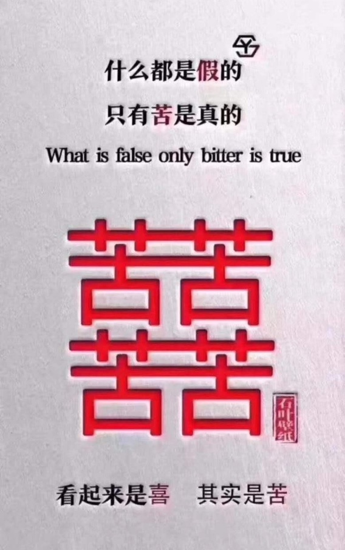

# Fantasy CJK Characters

<!-- START doctoc generated TOC please keep comment here to allow auto update -->
<!-- DON'T EDIT THIS SECTION, INSTEAD RE-RUN doctoc TO UPDATE -->
**Table of Contents**  *generated with [DocToc](https://github.com/thlorenz/doctoc)*

- [Fantasy CJK Characters](#fantasy-cjk-characters)
  - [twitter/hardmaru](#twitterhardmaru)
  - [twitter/enpitsu](#twitterenpitsu)
  - [twitter/rendicahya](#twitterrendicahya)
  - [twitter/skimcasual](#twitterskimcasual)
  - [namu.wiki/w/국악/음률](#namuwikiw%EA%B5%AD%EC%95%85%EC%9D%8C%EB%A5%A0)
  - [Old Chinese Lute Notation](#old-chinese-lute-notation)
  - [Counting Rod Numerals](#counting-rod-numerals)
  - [Erjian](#erjian)
  - [Looks Happy, Is Bitter](#looks-happy-is-bitter)
  - [Links](#links)
  - [To Do](#to-do)

<!-- END doctoc generated TOC please keep comment here to allow auto update -->

# Fantasy CJK Characters

## [twitter/hardmaru](https://twitter.com/hardmaru/status/1611237067589095425?ref_src=twsrc%5Etfw%7Ctwcamp%5Etweetembed%7Ctwterm%5E1611237067589095425%7Ctwgr%5E0d75f87a40ec63aeb2272a22ca2be7daaed58cc0%7Ctwcon%5Es1_&ref_url=https%3A%2F%2Flanguagelog.ldc.upenn.edu%2Fnll%2F%3Fp%3D57599)

> A #StableDiffusion model trained on images of Japanese Kanji characters came up with “Fake Kanji” for
> novel concepts like Skyscraper, Pikachu, Elon Musk, Deep Learning, YouTube, Gundam, Singularity, etc.
>
> They kind of make sense. Not bad!

## [twitter/enpitsu](https://twitter.com/enpitsu/status/1610587513059684353)

> お絵描きAI（Stable Diffusion）に漢字とその意味を1万字学習させて書き初めをさせました
>
> 順に「謹」「賀」「新」「年」です

## [twitter/rendicahya](https://twitter.com/rendicahya/status/1611270881363505152)

> Replying to @hardmaru and @StableDiffusion

## [twitter/skimcasual](https://twitter.com/skimcasual/status/1611596850347343875)

> This is basically ai art of Xu Bing's Book from the Sky

## [namu.wiki/w/국악/음률](https://namu.wiki/w/%EA%B5%AD%EC%95%85/%EC%9D%8C%EB%A5%A0)

> 청성과 배성
> 위에 소개한 음은 중간 음높이, 즉 '중성'이다. 이 음높이보다 한 옥타브가 올라가면 삼수변(氵)을 붙인다. 이런 음을 ‘청성’이라고 한다. 이를테면 黃이 ‘황’이면, 潢은 ‘청황’이라고 한다. 그보다 한 옥타브가 더 올라가면 삼수변을 두 개 붙인다. 이런 음을 ‘중청성’이라고 부른다. 이를테면, 㶂은 ‘중청황’이라고 한다. 악보상에서는 潢이나 㶂이나 그냥 ‘황’으로만 읽는다.
>
> 반대로, 중간 음높이보다 한 옥타브가 내려가면 사람인변(亻)을 붙인다. 이런 음을 ‘탁성’이나 ‘배성’이라고 한다. 이를테면 僙은 ‘배황’ 또는 ‘탁황’이라고 한다. 그보다 한 옥타브가 더 내려가면 두인변(彳)을 붙인다. 이런 음을 ‘배탁성’이나 '하배성'이라고 한다. 㣴은 ‘배탁황’ 또는 ‘하배황’이라고 한다. 역시 악보상에서는 僙이나 㣴이나 모두 ‘황’이라고 읽는다. 단 仲은 글자 자체에 이미 亻이 들어가 있으니 주의해야 한다. 仲의 배성은 㑖, 하배성은 㣡이니 혼동하지 않도록 주의해야 한다.
>
> 단소의 음정은 평취에서 仲, 林, 無, 潢, 汰이고 역취에서 㳞, 淋, 潕, 㶂, 㳲가 된다. 이때 단소를 배우는 초등학생들이 역취의 㶂, 㳲에서 삼수변이 두 개 붙는 것을 어려워하거나 헷갈릴까봐 음악선생이 "황이랑 태는 원래 삼수변 하나씩 있는 거에요 라고 엉뚱하게 가르치는 경우가 있다. 이래서 가끔 네이버 지식in에서 黃보다 1옥타브 높은 음이 潢이라고 쓰면 꼭 黃이란 음은 없고 潢이 원래 음이라고 태클 거는 사람이 있다(…). 潢과 㶂의 문제는 단순한 단소의 음역 문제이지 潢이 중성이라거나 하는 문제가 아니니, 혹시라도 아직까지 이렇게 알고 있는 분은 꼭 제대로 알아두자.

Translation by [Google Translate](https://translate.google.com):

> Cheongseong and Baeseong
>
> The note introduced above is the middle pitch, or 'neutral'. If the pitch is one octave higher than this
> pitch, a triple number is added. This sound is called ‘Qingseong’. For example, if 黃 is 'Hwang', then 潢 is
> 'Cheonghwang'. If you go one octave higher than that, add two triplets. This kind of sound is called
> 'mid-audit'. For example, 㶂 is said to be 'jungcheonghuang'. In sheet music, 潢 or 㶂 are read only as
> ‘Hwang’.
>
> Conversely, if the pitch is one octave lower than the mid-pitched pitch, a human person is added. This
> sound is called ‘takseong’ or ‘baeseong’. For example, 僙 is called 'Baehwang' or 'Takhwang'. If you go one
> octave lower than that, you add a duinbyeon (彳). This kind of sound is called 'backwardness' or
> 'lowerness'. 㣴 is called 'Bae Tak Hwang' or 'Ha Bae Hwang'. Likewise, on music scores, both 僙 and 㣴 are
> read as ‘Hwang’. However, be careful because 亻 is already in the character itself. 仲's baeseong is 㑖 and
> habaeseong is 㣡, so be careful not to confuse them.
>
> The pitch of Danso is 仲, 林, 無, 潢, 汰 in Pyeongchwi and 㳞, 淋, 潕, 㶂, 㳲 in Yeokchwi. At this time, fearing
> that elementary school students learning danso may find it difficult or confused about the two sides of 㶂
> and 㳲 in Yeokchwi, there are cases where the music teacher erroneously teaches, "Hwang and Tae originally
> have one three water side." For this reason, sometimes in Naver Jisikin, if you write that the note one
> octave higher than 黃 is 潢, there is no such thing as 黃, and there are people who criticize that 潢 is the
> original sound (...). The problem of 潢 and 㶂 is a simple transliteration problem of the minor, not that 潢
> is neutral.

<table class='sH7lKmx5' data-v-49dbfabe><tbody data-v-49dbfabe><tr data-v-49dbfabe><td style='text-align:center;' data-v-49dbfabe>
율명
</td><td style='text-align:center;' data-v-49dbfabe>
−2
</td><td style='text-align:center;' data-v-49dbfabe>
−1
</td><td style='text-align:center;' data-v-49dbfabe>
0
</td><td style='text-align:center;' data-v-49dbfabe>
+1
</td><td style='text-align:center;' data-v-49dbfabe>
+2
</td></tr><tr data-v-49dbfabe><td style='text-align:center;' data-v-49dbfabe>
황종(黃鐘)
</td><td style='text-align:center;' data-v-49dbfabe>
㣴
</td><td style='text-align:center;' data-v-49dbfabe>
僙
</td><td style='text-align:center;' data-v-49dbfabe>
黃
</td><td style='text-align:center;' data-v-49dbfabe>
潢
</td><td style='text-align:center;' data-v-49dbfabe>
㶂
</td></tr><tr data-v-49dbfabe><td style='text-align:center;' data-v-49dbfabe>
대려(大呂)
</td><td style='text-align:center;' data-v-49dbfabe>
㣕
</td><td style='text-align:center;' data-v-49dbfabe>
㐲
</td><td style='text-align:center;' data-v-49dbfabe>
大
</td><td style='text-align:center;' data-v-49dbfabe>
汏
</td><td style='text-align:center;' data-v-49dbfabe>
𣴘
</td></tr><tr data-v-49dbfabe><td style='text-align:center;' data-v-49dbfabe>
태주(太簇)
</td><td style='text-align:center;' data-v-49dbfabe>
㣖
</td><td style='text-align:center;' data-v-49dbfabe>
㑀
</td><td style='text-align:center;' data-v-49dbfabe>
太
</td><td style='text-align:center;' data-v-49dbfabe>
汰
</td><td style='text-align:center;' data-v-49dbfabe>
㳲
</td></tr><tr data-v-49dbfabe><td style='text-align:center;' data-v-49dbfabe>
협종(夾鐘)
</td><td style='text-align:center;' data-v-49dbfabe>
㣣
</td><td style='text-align:center;' data-v-49dbfabe>
俠
</td><td style='text-align:center;' data-v-49dbfabe>
夾
</td><td style='text-align:center;' data-v-49dbfabe>
浹
</td><td style='text-align:center;' data-v-49dbfabe>
㴺
</td></tr><tr data-v-49dbfabe><td style='text-align:center;' data-v-49dbfabe>
고선(姑洗)
</td><td style='text-align:center;' data-v-49dbfabe>
㣨
</td><td style='text-align:center;' data-v-49dbfabe>
㑬
</td><td style='text-align:center;' data-v-49dbfabe>
姑
</td><td style='text-align:center;' data-v-49dbfabe>
㴌
</td><td style='text-align:center;' data-v-49dbfabe>
㵈
</td></tr><tr data-v-49dbfabe><td style='text-align:center;' data-v-49dbfabe>
중려(仲呂)
</td><td style='text-align:center;' data-v-49dbfabe>
㣡
</td><td style='text-align:center;' data-v-49dbfabe>
㑖
</td><td style='text-align:center;' data-v-49dbfabe>
仲
</td><td style='text-align:center;' data-v-49dbfabe>
㳞
</td><td style='text-align:center;' data-v-49dbfabe>
㴢
</td></tr><tr data-v-49dbfabe><td style='text-align:center;' data-v-49dbfabe>
유빈(蕤賓)
</td><td style='text-align:center;' data-v-49dbfabe>
㣸
</td><td style='text-align:center;' data-v-49dbfabe>
𠐭
</td><td style='text-align:center;' data-v-49dbfabe>
㽔
</td><td style='text-align:center;' data-v-49dbfabe>
㶋
</td><td style='text-align:center;' data-v-49dbfabe>
㶙
</td></tr><tr data-v-49dbfabe><td style='text-align:center;' data-v-49dbfabe>
임종(林鐘)
</td><td style='text-align:center;' data-v-49dbfabe>
㣩
</td><td style='text-align:center;' data-v-49dbfabe>
㑣
</td><td style='text-align:center;' data-v-49dbfabe>
林
</td><td style='text-align:center;' data-v-49dbfabe>
淋
</td><td style='text-align:center;' data-v-49dbfabe>
㵉
</td></tr><tr data-v-49dbfabe><td style='text-align:center;' data-v-49dbfabe>
이칙(夷則)
</td><td style='text-align:center;' data-v-49dbfabe>
𢓡
</td><td style='text-align:center;' data-v-49dbfabe>
侇
</td><td style='text-align:center;' data-v-49dbfabe>
夷
</td><td style='text-align:center;' data-v-49dbfabe>
洟
</td><td style='text-align:center;' data-v-49dbfabe>
㴣
</td></tr><tr data-v-49dbfabe><td style='text-align:center;' data-v-49dbfabe>
남려(南呂)
</td><td style='text-align:center;' data-v-49dbfabe>
㣮
</td><td style='text-align:center;' data-v-49dbfabe>
㑲
</td><td style='text-align:center;' data-v-49dbfabe>
南
</td><td style='text-align:center;' data-v-49dbfabe>
湳
</td><td style='text-align:center;' data-v-49dbfabe>
㵜
</td></tr><tr data-v-49dbfabe><td style='text-align:center;' data-v-49dbfabe>
무역(無射)
</td><td style='text-align:center;' data-v-49dbfabe>
㣳
</td><td style='text-align:center;' data-v-49dbfabe>
㒇
</td><td style='text-align:center;' data-v-49dbfabe>
無
</td><td style='text-align:center;' data-v-49dbfabe>
潕
</td><td style='text-align:center;' data-v-49dbfabe>
㶃
</td></tr><tr data-v-49dbfabe><td style='text-align:center;' data-v-49dbfabe>
응종(應鐘)
</td><td style='text-align:center;' data-v-49dbfabe>
㣹
</td><td style='text-align:center;' data-v-49dbfabe>
㒣
</td><td style='text-align:center;' data-v-49dbfabe>
應
</td><td style='text-align:center;' data-v-49dbfabe>
㶐
</td><td style='text-align:center;' data-v-49dbfabe>
㶝
</td></tr></tbody></table>

By [拾萬字鏡 (@JUMANJIKYO)](https://twitter.com/jumanjikyo/status/860634434277486592):

> 「㳲」「㴢」「㴣」「㴺」「㵈」「㵉」「㵜」「㶂」「㶃」「㶙」「㶝」「𣴘」
>
> 「ろくすい」のこの12字，何なのかと思って調べたら周の時代に確立した音楽の十二律(今でいう十二音階)のオクターヴを表現するための文字らしい。旁は十二律の名称の語頭を取り，「ろくすい」は符号のような意味。

Also see: [zh.wiktionary.org/zh-hant/十二律](https://zh.m.wiktionary.org/zh-hant/%E5%8D%81%E4%BA%8C%E5%BE%8B)

## Old Chinese Lute Notation

* https://twitter.com/BabelStone/status/1057237047013007360
* Proposal to encode old Chinese lute notation.pdf

## Counting Rod Numerals

𝍠𝍡𝍢𝍣𝍤𝍥𝍦𝍧𝍨

𝍩𝍪𝍫𝍬𝍭𝍮𝍯𝍰𝍱

𝍩𝍪𝍫𝍬𝍸

𝍲𝍳𝍴𝍵𝍶
𝍷

<table class="wikitable nounderlines" style="border-collapse:collapse;background:#FFFFFF;font-size:large;text-align:center">
<tbody><tr>
<td colspan="17" style="background:#F8F8F8;font-size:small"><b><a class="mw-selflink selflink">Counting Rod Numerals</a></b><a href="#endnote_U1D360_as_of_Unicode_version">[1]</a><a href="#endnote_U1D360_grey">[2]</a> <a rel="nofollow" class="external text" href="https://www.unicode.org/charts/PDF/U1D360.pdf">Official Unicode Consortium code chart</a> (PDF)
</td></tr>
<tr style="background:#F8F8F8;font-size:small">
<td style="width:45pt">&#160;</td>
<td style="width:20pt">0</td>
<td style="width:20pt">1</td>
<td style="width:20pt">2</td>
<td style="width:20pt">3</td>
<td style="width:20pt">4</td>
<td style="width:20pt">5</td>
<td style="width:20pt">6</td>
<td style="width:20pt">7</td>
<td style="width:20pt">8</td>
<td style="width:20pt">9</td>
<td style="width:20pt">A</td>
<td style="width:20pt">B</td>
<td style="width:20pt">C</td>
<td style="width:20pt">D</td>
<td style="width:20pt">E</td>
<td style="width:20pt">F
</td></tr>
<tr>
<td style="background:#F8F8F8;font-size:small">U+1D36x
</td>
<td title="U+1D360: COUNTING ROD UNIT DIGIT ONE"><a href="/wiki/%F0%9D%8D%A0" class="mw-redirect" title="𝍠">&#x1d360;</a>
</td>
<td title="U+1D361: COUNTING ROD UNIT DIGIT TWO"><a href="/wiki/%F0%9D%8D%A1" class="mw-redirect" title="𝍡">&#x1d361;</a>
</td>
<td title="U+1D362: COUNTING ROD UNIT DIGIT THREE"><a href="/wiki/%F0%9D%8D%A2" class="mw-redirect" title="𝍢">&#x1d362;</a>
</td>
<td title="U+1D363: COUNTING ROD UNIT DIGIT FOUR"><a href="/wiki/%F0%9D%8D%A3" class="mw-redirect" title="𝍣">&#x1d363;</a>
</td>
<td title="U+1D364: COUNTING ROD UNIT DIGIT FIVE"><a href="/wiki/%F0%9D%8D%A4" class="mw-redirect" title="𝍤">&#x1d364;</a>
</td>
<td title="U+1D365: COUNTING ROD UNIT DIGIT SIX"><a href="/wiki/%F0%9D%8D%A5" class="mw-redirect" title="𝍥">&#x1d365;</a>
</td>
<td title="U+1D366: COUNTING ROD UNIT DIGIT SEVEN"><a href="/wiki/%F0%9D%8D%A6" class="mw-redirect" title="𝍦">&#x1d366;</a>
</td>
<td title="U+1D367: COUNTING ROD UNIT DIGIT EIGHT"><a href="/wiki/%F0%9D%8D%A7" class="mw-redirect" title="𝍧">&#x1d367;</a>
</td>
<td title="U+1D368: COUNTING ROD UNIT DIGIT NINE"><a href="/wiki/%F0%9D%8D%A8" class="mw-redirect" title="𝍨">&#x1d368;</a>
</td>
<td title="U+1D369: COUNTING ROD TENS DIGIT ONE"><a href="/wiki/%F0%9D%8D%A9" class="mw-redirect" title="𝍩">&#x1d369;</a>
</td>
<td title="U+1D36A: COUNTING ROD TENS DIGIT TWO"><a href="/wiki/%F0%9D%8D%AA" class="mw-redirect" title="𝍪">&#x1d36a;</a>
</td>
<td title="U+1D36B: COUNTING ROD TENS DIGIT THREE"><a href="/wiki/%F0%9D%8D%AB" class="mw-redirect" title="𝍫">&#x1d36b;</a>
</td>
<td title="U+1D36C: COUNTING ROD TENS DIGIT FOUR"><a href="/wiki/%F0%9D%8D%AC" class="mw-redirect" title="𝍬">&#x1d36c;</a>
</td>
<td title="U+1D36D: COUNTING ROD TENS DIGIT FIVE"><a href="/wiki/%F0%9D%8D%AD" class="mw-redirect" title="𝍭">&#x1d36d;</a>
</td>
<td title="U+1D36E: COUNTING ROD TENS DIGIT SIX"><a href="/wiki/%F0%9D%8D%AE" class="mw-redirect" title="𝍮">&#x1d36e;</a>
</td>
<td title="U+1D36F: COUNTING ROD TENS DIGIT SEVEN"><a href="/wiki/%F0%9D%8D%AF" class="mw-redirect" title="𝍯">&#x1d36f;</a>
</td></tr>
<tr>
<td style="background:#F8F8F8;font-size:small">U+1D37x
</td>
<td title="U+1D370: COUNTING ROD TENS DIGIT EIGHT"><a href="/wiki/%F0%9D%8D%B0" class="mw-redirect" title="𝍰">&#x1d370;</a>
</td>
<td title="U+1D371: COUNTING ROD TENS DIGIT NINE"><a href="/wiki/%F0%9D%8D%B1" class="mw-redirect" title="𝍱">&#x1d371;</a>
</td>
<td title="U+1D372: IDEOGRAPHIC TALLY MARK ONE"><a href="/wiki/%F0%9D%8D%B2" class="mw-redirect" title="𝍲">&#x1d372;</a>
</td>
<td title="U+1D373: IDEOGRAPHIC TALLY MARK TWO"><a href="/wiki/%F0%9D%8D%B3" class="mw-redirect" title="𝍳">&#x1d373;</a>
</td>
<td title="U+1D374: IDEOGRAPHIC TALLY MARK THREE"><a href="/wiki/%F0%9D%8D%B4" class="mw-redirect" title="𝍴">&#x1d374;</a>
</td>
<td title="U+1D375: IDEOGRAPHIC TALLY MARK FOUR"><a href="/wiki/%F0%9D%8D%B5" class="mw-redirect" title="𝍵">&#x1d375;</a>
</td>
<td title="U+1D376: IDEOGRAPHIC TALLY MARK FIVE"><a href="/wiki/%F0%9D%8D%B6" class="mw-redirect" title="𝍶">&#x1d376;</a>
</td>
<td title="U+1D377: TALLY MARK ONE"><a href="/wiki/%F0%9D%8D%B7" class="mw-redirect" title="𝍷">&#x1d377;</a>
</td>
<td title="U+1D378: TALLY MARK FIVE"><a href="/wiki/%F0%9D%8D%B8" class="mw-redirect" title="𝍸">&#x1d378;</a>
</td>
<td title="Reserved" style="background-color:#CCCCCC;">
</td>
<td title="Reserved" style="background-color:#CCCCCC;">
</td>
<td title="Reserved" style="background-color:#CCCCCC;">
</td>
<td title="Reserved" style="background-color:#CCCCCC;">
</td>
<td title="Reserved" style="background-color:#CCCCCC;">
</td>
<td title="Reserved" style="background-color:#CCCCCC;">
</td>
<td title="Reserved" style="background-color:#CCCCCC;">
</td></tr>
</tbody></table>

## Erjian

* https://babelstone.co.uk/Fonts/Han.html
* https://www.babelstone.co.uk/Fonts/Erjian.html
* https://www.babelstone.co.uk/Blog/2009/10/modest-proposal-to-encode-ultra.html

## Looks Happy, Is Bitter

* [*The reality of Happiness is Bitterness* by V. Mair,
  2023-03-09](https://languagelog.ldc.upenn.edu/nll/?p=58160)

> The actual transcription and translation of the first two lines and their one line English mistranslation should be:
>
> Shénme dōu shì jiǎ de
>
> Zhǐyǒu kǔ shì zhēn de
>
> 什么都是假的
>
> 只有苦是真的
>
> Everything is false
>
> Only suffering is real
>
> The next big, composite, quadripartite glyph consists of four "kǔ 苦" ("bitterness; suffering") stacked side by side and on top of each other
>
> 苦苦
>
> 苦苦
>
> making them look somewhat like the famous "double happiness" character that we discussed in detail several times before (see the "Selected readings" below).
>
> 囍
>
> Depending on your point of view, that is pronounced xǐ, xǐxǐ, or shuāngxǐ (maybe someone else even has another way to pronounce it).  No matter how it's pronounced, I think everyone would agree that it means "double happiness" (see also here, here, and here).
>
> The line at the bottom reads:
>
> Kàn qǐlái shì xǐ      qíshí shì kǔ
>
> 看起来是喜    其实是苦
>
> It looks like happiness, but it's actually bitterness
>
> I don't know who would circulate such a notice, and under what circumstances, even if it were properly translated.

## Links

* https://de.wikipedia.org/wiki/Xu_Bing

## To Do

* **[–]** u-cjk-xb/203f9 𠏹:⿰亻⿱覀国
* **[–]** jzr/e250 &jzr#xe250;:⿰亻⿱覀國
* **[–]** names for chemical elements
* **[–]** 熵: entropy
* **[–]** 雙喜 u-cjk/56cd 囍:⿰喜喜
* **[–]** 招財進寶
* **[–]** duang
* **[–]** 𰻞𰻞麵 u-cjk-xg/30ede 𰻞𰻞麵 u-cjk-xg/30edd
  * see https://zh.wikipedia.org/wiki/%F0%B0%BB%9D%F0%B0%BB%9D%E9%9D%A2
  * [copy of the above](https://raw.githubusercontent.com/loveencounterflow/jizura-fantasy-cjk-characters/main/wikipedia-biangbiang.html)
* **[–]** unify with [loveencounterflow/chinese-characters-missing-from-unicode](https://github.com/loveencounterflow/chinese-characters-missing-from-unicode)?
* **[–]** unify with [loveencounterflow/Species-Characterum-Sinensium](https://github.com/loveencounterflow/Species-Characterum-Sinensium)?

